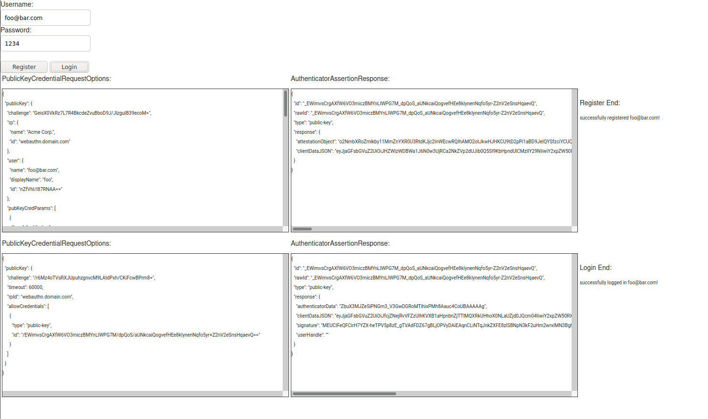

# Simple webauthn demo app


Demo application that shows the request/response flows used during WebAuthn flow.

This is really just a copy of the following

- [https://github.com/hbolimovsky/webauthn-example](https://github.com/hbolimovsky/webauthn-example)

or just like...you know [https://webauthn.io/](https://webauthn.io/)


but adapted for cloud run..i'd encourage you to read the following

- [How security keys store credentials](https://duo.com/labs/tech-notes/how-security-keys-store-credentials)
https://webauthn-6w42z6vi3q-uc.a.run.app/

- [WebAuthn Basic Web Client/Server](https://www.herbie.dev/blog/webauthn-basic-web-client-server/)

- [WebAuthn Client Registration](https://developers.yubico.com/WebAuthn/WebAuthn_Developer_Guide/WebAuthn_Client_Registration.html)

- [WebAuthn Client Authentication](https://developers.yubico.com/WebAuthn/WebAuthn_Developer_Guide/WebAuthn_Client_Authentication.html)

- [Discoverable Credentials / Resident Keys](https://developers.yubico.com/WebAuthn/WebAuthn_Developer_Guide/Resident_Keys.html)

---

You can use a security token on multiple sites safely since each site's registration will cause the token to generate a new and unique keypair intended for that site alone.  THe specific flow we used in this app does *NOT* save the keys into the hardware token (i.e, the server sends down the encrypted public/privatekey that was sent during registration).  In that flow, the security token will decrypt the private key that it got from the server.  In other words, we do NOT enable [Discoverable Credentials / Resident Keys](https://developers.yubico.com/WebAuthn/WebAuthn_Developer_Guide/Resident_Keys.html)

The app simply saves the user's credential into memory...so restarts of cloud run will delete any piror registrations (ideally, you'd save the server-side references to a user's security token with the user's object somewhere like GCP Firestore)


---

### Deploy

To run locally

edit `/etc/hosts`
```
127.0.0.1 webauthn.domain.com
```

run directly:

```
go run . --useTLS --rpid=webauthn.domain.com --rporigin=https://webauthn.domain.com:8080
```

or via docker

```bash
export PROJECT_ID=`gcloud config get-value core/project`

docker build -t gcr.io/$PROJECT_ID/webauthn .
docker run -p 8080:8080 gcr.io/$PROJECT_ID/webauthn --useTLS --rpid=webauthn.domain.com --rporigin=https://webauthn.domain.com:8080

docker push  gcr.io/$PROJECT_ID/webauthn

```

To deploy into cloud run, just do the following 

```bash

docker push  gcr.io/$PROJECT_ID/webauthn

# first deploy to figure out the serving URL 

gcloud beta run deploy webauthn  --image gcr.io/$PROJECT_ID/webauthn  --allow-unauthenticated  --region us-central1  --platform=managed  -q
export SERVING_URL=`gcloud run services describe webauthn --format="value(status.url)"`
export SERVING_HOST=`echo "$SERVING_URL" | awk -F/ '{print $3}'`


gcloud beta run deploy webauthn  --image gcr.io/$PROJECT_ID/webauthn --args="--rpid=$SERVING_HOST,--rporigin=$SERVING_URL" --allow-unauthenticated  --region us-central1  --platform=managed  -q

```

After that, navigate to the serving url, click `Register` then once thats complete, click `Login`


I've left it running here [https://webauthn-6w42z6vi3q-uc.a.run.app](https://webauthn-6w42z6vi3q-uc.a.run.app)


### Usage

TO use,  first click the 'Register' button 



1. this will cause the server to send down a challenge to the browser:

```json
{
  "publicKey": {
    "challenge": "rYo6ILZWlTJOWMSdDi9LEduHfO5gmdFg6PlZVjWtjSk=",
    "rp": {
      "name": "Acme Corp.",
      "id": "webauthn-6w42z6vi3q-uc.a.run.app"
    },
    "user": {
      "name": "foo@bar.com",
      "displayName": "foo",
      "id": "2OicjpGihaLnAQ=="
    },
    "pubKeyCredParams": [
      {
        "type": "public-key",
        "alg": -7
      },
      {
        "type": "public-key",
        "alg": -35
      },
      {
        "type": "public-key",
        "alg": -36
      },
      {
        "type": "public-key",
        "alg": -257
      },
      {
        "type": "public-key",
        "alg": -258
      },
      {
        "type": "public-key",
        "alg": -259
      },
      {
        "type": "public-key",
        "alg": -37
      },
      {
        "type": "public-key",
        "alg": -38
      },
      {
        "type": "public-key",
        "alg": -39
      },
      {
        "type": "public-key",
        "alg": -8
      }
    ],
    "authenticatorSelection": {
      "requireResidentKey": false
    },
    "timeout": 60000,
    "attestation": "direct"
  }
}
```


2. The webauthn library javascript library will then use the security token to generate a keypair and sign a JWT using the private key.  The payload that is sent to the server looks like

```json
{
  "id": "lYYD4GOGClluI_oGHgdfbqtwH9jsPyl5pcjd4sRe3a6QSJ4a5TAKF3snegCqJrqcLtIDbbloB-jHOz6HXtvSYw",
  "rawId": "lYYD4GOGClluI_oGHgdfbqtwH9jsPyl5pcjd4sRe3a6QSJ4a5TAKF3snegCqJrqcLtIDbbloB-jHOz6HXtvSYw",
  "type": "public-key",
  "response": {
    "attestationObject": "o2NmbXRoZmlkby11MmZnYXR0U3RtdKJjc2lnWEcwRQIhAKRQdmuL970EP3iXl3whHLL4NwAsFj50zZ8OZm_konaqAiBvGFLhftvVQeWNIzyKG6wL5b7_ZuZP7ZAYvzbAs0cwYmN4NWOBWQLBMIICvTCCAaWgAwIBAgIEHo-HNDANBgkqhkiG9w0BAQsFADAuMSwwKgYDVQQDEyNZdWJpY28gVTJGIFJvb3QgQ0EgU2VyaWFsIDQ1NzIwMDYzMTAgFw0xNDA4MDEwMDAwMDBaGA8yMDUwMDkwNDAwMDAwMFowbjELMAkGA1UEBhMCU0UxEjAQBgNVBAoMCVl1YmljbyBBQjEiMCAGA1UECwwZQXV0aGVudGljYXRvciBBdHRlc3RhdGlvbjEnMCUGA1UEAwweWXViaWNvIFUyRiBFRSBTZXJpYWwgNTEyNzIyNzQwMFkwEwYHKoZIzj0CAQYIKoZIzj0DAQcDQgAEqHn4IzjtFJS6wHBLzH_GY9GycXFZdiQxAcdgURXXwVKeKBwcZzItOEtc1V3T6YGNX9hcIq8ybgxk_CCv4z8jZqNsMGowIgYJKwYBBAGCxAoCBBUxLjMuNi4xLjQuMS40MTQ4Mi4xLjcwEwYLKwYBBAGC5RwCAQEEBAMCBDAwIQYLKwYBBAGC5RwBAQQEEgQQL8BXn4ETR-qxFrtajbkgKjAMBgNVHRMBAf8EAjAAMA0GCSqGSIb3DQEBCwUAA4IBAQCGk_9i3w1XedR0jX_I0QInMYqOWA5qOlfBCOlOA8OFaLNmiU_OViS-Sj79fzQRiz2ZN0P3kqGYkWDI_JrgsE49-e4V4-iMBPyCqNy_WBjhCNzCloV3rnn_ZiuUc0497EWXMF1z5uVe4r65zZZ4ygk15TPrY4-OJvq7gXzaRB--mDGDKuX24q2ZL56720xiI4uPjXq0gdbTJjvNv55KV1UDcJiK1YE0QPoDLK22cjyt2PjXuoCfdbQ8_6Clua3RQjLvnZ4UgSY4IzxMpKhzufismOMroZFnYG4VkJ_N20ot_72uRiAkn5pmRqyB5IMtERn-v6pzGogtolp3gn1G0ZAXaGF1dGhEYXRhWMTCALVkc1itLCHQlwLbZmyGBZFZay-NDkefG5JNsfK_lkEAAAAAAAAAAAAAAAAAAAAAAAAAAABAlYYD4GOGClluI_oGHgdfbqtwH9jsPyl5pcjd4sRe3a6QSJ4a5TAKF3snegCqJrqcLtIDbbloB-jHOz6HXtvSY6UBAgMmIAEhWCDo60Kk17zAe-7HuQXTvigWo0RMOEGBXQEo8fz1lY1yMSJYIKBu4iZ-1tNvBpBO-KrpM2a59FRhP877_UDFvDeZddl2",
    "clientDataJSON": "eyJjaGFsbGVuZ2UiOiJyWW82SUxaV2xUSk9XTVNkRGk5TEVkdUhmTzVnbWRGZzZQbFpWald0alNrIiwiY2xpZW50RXh0ZW5zaW9ucyI6e30sImhhc2hBbGdvcml0aG0iOiJTSEEtMjU2Iiwib3JpZ2luIjoiaHR0cHM6Ly93ZWJhdXRobi02dzQyejZ2aTNxLXVjLmEucnVuLmFwcCIsInR5cGUiOiJ3ZWJhdXRobi5jcmVhdGUifQ"
  }
}
```
See the documentation links about the attestation object

the decoded `clientDataJSON` is

```json
{
  "challenge": "rYo6ILZWlTJOWMSdDi9LEduHfO5gmdFg6PlZVjWtjSk",
  "clientExtensions": {},
  "hashAlgorithm": "SHA-256",
  "origin": "https://webauthn-6w42z6vi3q-uc.a.run.app",
  "type": "webauthn.create"
}
```

After signature validation, the server will associate the user with the provided public key and `id` field.  Note in this flow, the `id` field includes the encrypted private key used for by the users security token.  Only that one security token can decode `"id": "lYYD4GOGClluI/oGHgdfbqtwH9jsPyl5pcjd4sRe3a6QSJ4a5TAKF3snegCqJrqcLtIDbbloB+jHOz6HXtvSYw=="`

3. Login

For the login flow, the user provides his/her userid/password.  The server then sends down the `id:` field it had associated with the user.  As mentioned, the id field has the encrypted private key for that token.

```json
{
  "publicKey": {
    "challenge": "kp7Glun8Wb89YexYFqN3Lg8qtBphvKLum3LfOIdiuOY=",
    "timeout": 60000,
    "rpId": "webauthn-6w42z6vi3q-uc.a.run.app",
    "allowCredentials": [
      {
        "type": "public-key",
        "id": "lYYD4GOGClluI/oGHgdfbqtwH9jsPyl5pcjd4sRe3a6QSJ4a5TAKF3snegCqJrqcLtIDbbloB+jHOz6HXtvSYw=="
      }
    ]
  }
}
```
4. The browser will ask the security token to decode the `id` field, then sign the challenge with the saved encryted key.  The response signature and object is sent back to the server

```json
{
  "id": "lYYD4GOGClluI_oGHgdfbqtwH9jsPyl5pcjd4sRe3a6QSJ4a5TAKF3snegCqJrqcLtIDbbloB-jHOz6HXtvSYw",
  "rawId": "lYYD4GOGClluI_oGHgdfbqtwH9jsPyl5pcjd4sRe3a6QSJ4a5TAKF3snegCqJrqcLtIDbbloB-jHOz6HXtvSYw",
  "type": "public-key",
  "response": {
    "authenticatorData": "wgC1ZHNYrSwh0JcC22ZshgWRWWsvjQ5HnxuSTbHyv5YBAAAABA",
    "clientDataJSON": "eyJjaGFsbGVuZ2UiOiJrcDdHbHVuOFdiODlZZXhZRnFOM0xnOHF0QnBodktMdW0zTGZPSWRpdU9ZIiwiY2xpZW50RXh0ZW5zaW9ucyI6e30sImhhc2hBbGdvcml0aG0iOiJTSEEtMjU2Iiwib3JpZ2luIjoiaHR0cHM6Ly93ZWJhdXRobi02dzQyejZ2aTNxLXVjLmEucnVuLmFwcCIsInR5cGUiOiJ3ZWJhdXRobi5nZXQifQ",
    "signature": "MEYCIQCew6zhRmc0_HV95sAtxzTlcd5q4tsDD5fqxYGaxPoBywIhAPMXbU32JXEuhcBAe0c1sFOsMLNOJKG67BNz1_awaQLK",
    "userHandle": ""
  }
}
```

THe decoded `clientDataJSON` is

```json
{
  "challenge": "kp7Glun8Wb89YexYFqN3Lg8qtBphvKLum3LfOIdiuOY",
  "clientExtensions": {},
  "hashAlgorithm": "SHA-256",
  "origin": "https://webauthn-6w42z6vi3q-uc.a.run.app",
  "type": "webauthn.get"
}
```

The server at this point can verify the signature against the saved id field/public key

